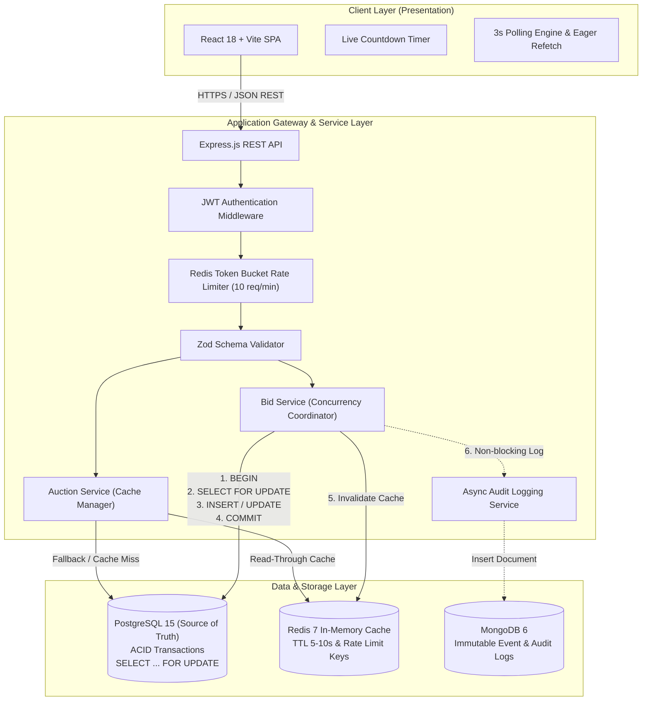
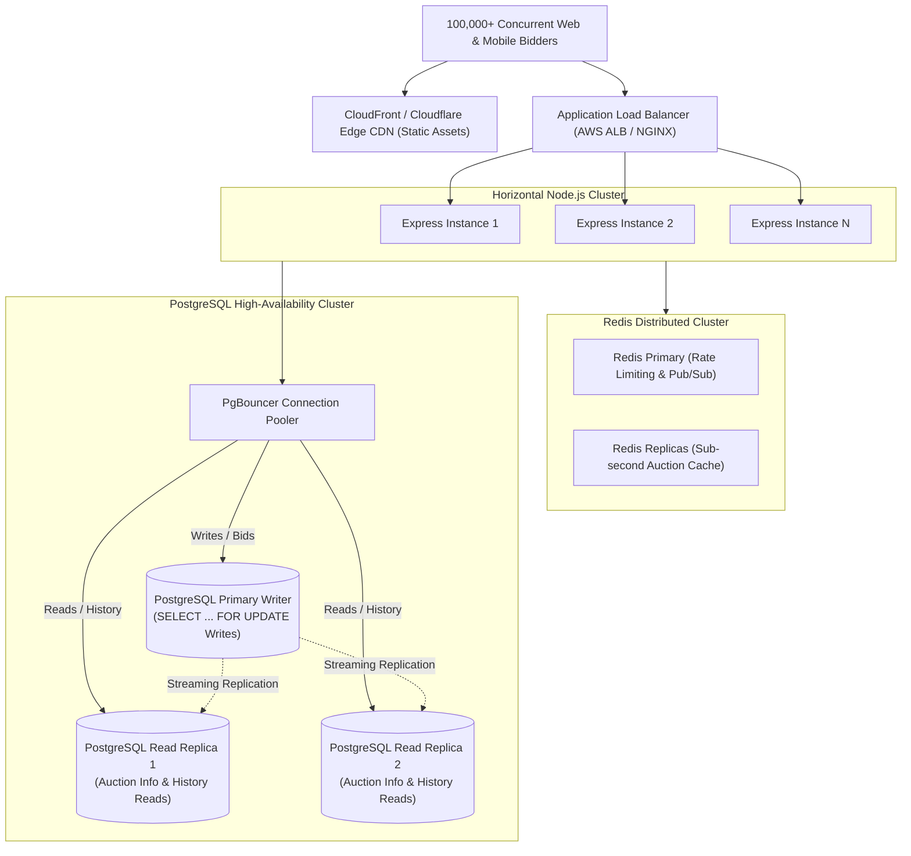

# 📑 System Design Document: High-Concurrency Online Auction System

**Author**: Senior Full-Stack Software Engineer Candidate  
**Target Organization**: Bellcorp Studio  
**Role**: Senior Full-Stack Software Engineer Placement Assessment  
**Date**: August 2026  

---

## 1. Problem Understanding & Business Requirements

### 1.1 Problem Statement
The objective is to design and implement an industrial-grade, fault-tolerant Online Auction System. The platform allows registered users to discover active auctions, inspect current pricing, submit higher bids in real time, and monitor auction countdowns.

### 1.2 Core Business Rules
1. **Strict Ascending Order**: Every accepted bid must be strictly greater than the current highest bid ($Bid_{new} > Bid_{current}$).
2. **Fixed Duration Window**: Bids are only valid while the authoritative server/database clock is before the auction's end timestamp ($T_{db} < T_{end}$).
3. **Deterministic Concurrency**: When two or more bids of equal or conflicting values are dispatched within milliseconds of each other, the system must deterministically accept exactly one bid and reject all conflicting bids.
4. **Authoritative Backend**: The frontend countdown is strictly a presentation layer. The database transaction is the sole authoritative arbiter of auction validity.

---

## 2. System Assumptions

1. **Monetary Representation**: Currency values are represented as high-precision decimals (`NUMERIC(12, 2)`) to avoid IEEE 754 binary floating-point rounding inaccuracies.
2. **Single Primary Item Auction**: While the schema natively supports multi-item auctions, the core assessment flow focuses on a seeded flagship item ("Vintage Watch") with configurable duration.
3. **Asynchronous Audit Non-Interference**: Failures in external analytical/audit sinks (MongoDB) must never abort or roll back a financially valid transaction in the primary store (PostgreSQL).
4. **Real-time UX Strategy**: Polling (3s interval) with eager refetching upon bid placement provides sufficient real-time fidelity for a 2-day delivery cycle without WebSocket overhead.

---

## 3. High-Level Architecture (HLD)

### 3.1 Mermaid Architecture Diagram



---

## 4. Database Schema & Data Models

### 4.1 PostgreSQL Schema (Relational Source of Truth)

```sql
-- 1. Users Table
CREATE TABLE users (
    id UUID PRIMARY KEY,
    name VARCHAR(255) NOT NULL,
    email VARCHAR(255) UNIQUE NOT NULL,
    password_hash VARCHAR(255) NOT NULL,
    created_at TIMESTAMP WITH TIME ZONE DEFAULT CURRENT_TIMESTAMP
);
CREATE INDEX idx_users_email ON users(email);

-- 2. Auctions Table
CREATE TABLE auctions (
    id UUID PRIMARY KEY,
    title VARCHAR(255) NOT NULL,
    description TEXT,
    starting_price NUMERIC(12, 2) NOT NULL,
    current_highest_bid NUMERIC(12, 2) NOT NULL,
    highest_bidder_id UUID REFERENCES users(id) ON DELETE SET NULL,
    start_time TIMESTAMP WITH TIME ZONE NOT NULL,
    end_time TIMESTAMP WITH TIME ZONE NOT NULL,
    status VARCHAR(20) NOT NULL DEFAULT 'ACTIVE',
    created_at TIMESTAMP WITH TIME ZONE DEFAULT CURRENT_TIMESTAMP
);
CREATE INDEX idx_auctions_status ON auctions(status);
CREATE INDEX idx_auctions_end_time ON auctions(end_time);

-- 3. Bids Table
CREATE TABLE bids (
    id UUID PRIMARY KEY,
    auction_id UUID NOT NULL REFERENCES auctions(id) ON DELETE CASCADE,
    bidder_id UUID NOT NULL REFERENCES users(id) ON DELETE CASCADE,
    amount NUMERIC(12, 2) NOT NULL,
    created_at TIMESTAMP WITH TIME ZONE DEFAULT CURRENT_TIMESTAMP
);
CREATE INDEX idx_bids_auction_id ON bids(auction_id);
CREATE INDEX idx_bids_bidder_id ON bids(bidder_id);
CREATE INDEX idx_bids_created_at ON bids(created_at DESC);
```

### 4.2 MongoDB Schema (Document Audit Log)

```json
{
  "_id": "ObjectId('...')",
  "event": "BID_PLACED | BID_REJECTED | USER_REGISTERED | USER_LOGIN | AUCTION_ENDED",
  "auctionId": "UUID",
  "userId": "UUID",
  "amount": 700.00,
  "timestamp": "2026-08-26T14:30:00.000Z",
  "metadata": {
    "bidId": "UUID",
    "previousHighestBid": 650.00,
    "error": null,
    "ip": "127.0.0.1"
  }
}
```

---

## 5. PostgreSQL vs. MongoDB Architectural Decision

| Requirement | Selected Database | Architectural Rationale |
|---|---|---|
| **Auction State & Bids** | **PostgreSQL** | Strict ACID compliance, relational integrity (foreign keys between users, auctions, and bids), row-level serializability via `SELECT ... FOR UPDATE`. Prevents race conditions and double-spending. |
| **Audit & Event Logs** | **MongoDB** | Schema-flexible, high write-throughput, append-only document store. Decoupled from transactional database overhead. |
| **Why not MongoDB for Bids?** | Rejected | MongoDB multi-document transactions introduce distributed locking overhead and lack declarative relational constraints required for financial auction consistency. |

---

## 6. Detailed Concurrency Strategy

### 6.1 The Race Condition Threat
Consider two users submitting a ₹700 bid simultaneously on an item whose current highest bid is ₹650:

```
Timeline (Without Locking):
T1: Connection A queries highest bid -> Reads 650
T2: Connection B queries highest bid -> Reads 650
T3: Connection A checks 700 > 650 -> Valid
T4: Connection B checks 700 > 650 -> Valid
T5: Connection A updates highest bid to 700 -> Committed
T6: Connection B updates highest bid to 700 -> Committed (CORRUPTION: Duplicate winner)
```

### 6.2 The Row-Level Locking Implementation
Our solution executes all validation, insertion, and mutation inside a single PostgreSQL transaction holding an exclusive lock on the target auction row:

```sql
BEGIN;
SELECT id, starting_price, current_highest_bid, highest_bidder_id, end_time, status, NOW() AS current_db_time
FROM auctions
WHERE id = $1
FOR UPDATE;

-- Execution logic within transaction:
-- 1. If auction is NULL -> ROLLBACK -> HTTP 404 AUCTION_NOT_FOUND
-- 2. If status != 'ACTIVE' -> ROLLBACK -> HTTP 409 AUCTION_ENDED
-- 3. If current_db_time >= end_time -> UPDATE status = 'ENDED' -> ROLLBACK -> HTTP 409 AUCTION_ENDED
-- 4. If submitted_amount <= current_highest_bid -> ROLLBACK -> HTTP 409 BID_TOO_LOW
-- 5. INSERT INTO bids (id, auction_id, bidder_id, amount, created_at) VALUES ($1, $2, $3, $4, NOW());
-- 6. UPDATE auctions SET current_highest_bid = $amount, highest_bidder_id = $bidder_id WHERE id = $auction_id;
COMMIT;
```

### 6.3 Concurrency Execution Trace Under Contention
```
Timeline (With SELECT ... FOR UPDATE):
T1: Request A: BEGIN -> SELECT ... FOR UPDATE (Acquires Row Lock)
T2: Request B: BEGIN -> SELECT ... FOR UPDATE (Blocked by PG Engine, waiting for Lock)
T3: Request A: Validates 700 > 650 (OK) -> Inserts Bid -> Updates Highest Bid to 700 -> COMMIT (Releases Lock)
T4: Request B: Unblocks -> Reads fresh committed row: highest bid is now 700
T5: Request B: Validates 700 > 700 (FALSE) -> ROLLBACK -> Returns HTTP 409 BID_TOO_LOW
```

---

## 7. Redis Caching & Rate-Limiting Strategy

### 7.1 Read-Through Caching
- **Key Pattern**: `auction:{auctionId}` and `auction:current`
- **Payload**: JSON snapshot of auction details, current leader name, and timestamps.
- **TTL**: 5–10 seconds.
- **Invalidation Trigger**: `auctionService.invalidateCache(auctionId)` called immediately upon PostgreSQL transaction commit.

### 7.2 Sliding Token Rate Limiting
- **Endpoint**: `POST /api/auction/:id/bids`
- **Key Pattern**: `ratelimit:bid:{userId}`
- **Constraint**: Maximum 10 bids per user per 60-second window.
- **Implementation**: Atomic Redis pipeline (`INCR` + `EXPIRE`). If count > 10, middleware returns `HTTP 429 RATE_LIMIT_EXCEEDED`.
- **Fault-Tolerant Fallback**: In case of Redis connection downtime, falls back to a memory token bucket without interrupting database transactions.

---

## 8. Security & Validation Architecture

1. **Authentication**: JWT signed with HMAC SHA-256 (`HS256`) using an environment-isolated secret. Bearer token extracted and verified on protected endpoints.
2. **Password Security**: Passwords hashed using `bcryptjs` with 10 salt rounds. Plaintext passwords never reach storage or logs.
3. **Input Validation**: Strict runtime schema validation using `Zod` for request bodies and query parameters.
4. **SQL Injection Defense**: 100% parameterized queries (`$1, $2`).
5. **HTTP Defense**: `helmet` headers enabled for DNS prefetch control, frameguard, and XSS filtering.

---

## 9. Error Handling & Standardized API Contract

All API responses strictly adhere to uniform JSON contracts:

### 9.1 Success Contract (`HTTP 200 / 201`)
```json
{
  "success": true,
  "message": "Bid accepted.",
  "data": { ... }
}
```

### 9.2 Error Contract (`HTTP 4xx / 5xx`)
```json
{
  "success": false,
  "error": "ERROR_CODE",
  "message": "Human-readable explanation.",
  "details": null
}
```

### 9.3 Error Matrix
| Error Code | HTTP Status | Trigger Condition |
|---|---|---|
| `VALIDATION_ERROR` | 400 | Zod schema validation failed |
| `UNAUTHORIZED` | 401 | Missing or invalid JWT bearer token |
| `INVALID_CREDENTIALS` | 401 | Incorrect password or unverified email |
| `AUCTION_NOT_FOUND` | 404 | Auction UUID does not exist |
| `EMAIL_EXISTS` | 409 | User registration with duplicate email |
| `BID_TOO_LOW` | 409 | Submitted bid amount $\le$ current highest bid |
| `AUCTION_ENDED` | 409 | Submitted bid after auction expiration timestamp |
| `RATE_LIMIT_EXCEEDED`| 429 | User exceeded 10 bids per minute |
| `INTERNAL_SERVER_ERROR`| 500 | Unexpected uncaught exception (stack trace omitted) |

---

## 10. Scalability Plan: Handling 100x Load



### Key Scaling Strategies:
1. **Stateless App Instances**: Horizontal autoscaling of Node.js services behind an Application Load Balancer.
2. **Read/Write Query Splitting**: 95% of traffic is read-intensive (polling, auction metadata, bid history). Route reads to read replicas, reserving the primary writer for `FOR UPDATE` bid transactions.
3. **PgBouncer Connection Pooling**: Avoids Postgres process exhaustions by multiplexing thousands of incoming HTTP requests across a pool of ~50 physical database connections.
4. **Sub-second Redis Caching**: Absorbs high-volume status polling from thousands of concurrent clients.

---

## 11. Verification & Test Strategy

| Test Suite | Scenario Verified | Result |
|---|---|---|
| `tests/concurrency.test.js` | **Simultaneous ₹700 bids on ₹650 item** | **PASS** (1 Accepted [201], 1 Rejected [409]) |
| `tests/concurrency.test.js` | **Concurrent multi-user swarm bidding** | **PASS** (Leader strictly updated to highest bid) |
| `tests/bid.test.js` | Valid bid increment | **PASS** (HTTP 201) |
| `tests/bid.test.js` | Lower bid ($550 \le 600$) | **PASS** (HTTP 409 `BID_TOO_LOW`) |
| `tests/bid.test.js` | Equal bid ($600 \le 600$) | **PASS** (HTTP 409 `BID_TOO_LOW`) |
| `tests/bid.test.js` | Expired auction bid rejection | **PASS** (HTTP 409 `AUCTION_ENDED`) |
| `tests/bid.test.js` | Paginated bid history (`?page=1&limit=2`) | **PASS** (Accurate totals and slicing) |
| `tests/auth.test.js` | Register, Duplicate 409, Login, `/me` | **PASS** (Full JWT lifecycle) |
| `tests/redis.test.js` | Cache population, invalidation, 10 req/min rate limit | **PASS** (11th bid returns 429) |
| `tests/mongo.test.js` | Asynchronous audit logs (`BID_PLACED`, `BID_REJECTED`)| **PASS** (Decoupled and persisted) |

---

## 12. Trade-offs & Future Improvements

1. **Polling vs. WebSockets**: Polling was selected for clean, reliable 2-day delivery. For production scale, introducing a Redis Pub/Sub WebSocket gateway reduces network overhead.
2. **Optimistic Locking vs. Pessimistic Locking**: `SELECT ... FOR UPDATE` (Pessimistic) was chosen to guarantee 100% correctness without retry loop churn under extreme contention. For ultra-high write scenarios across different items, optimistic locking with version counters can be evaluated.
3. **Auction Anti-Sniping (Soft Close)**: Automatically extending auction duration by 2 minutes if a bid is placed in the final 30 seconds to simulate real-world auction dynamics.
